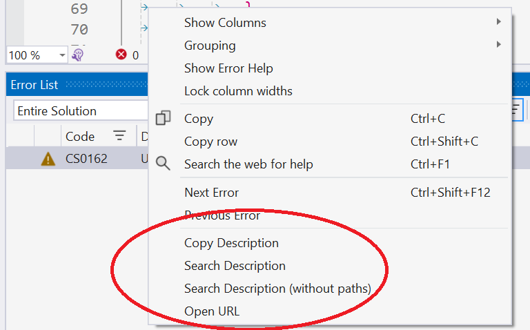

# ErrorHelper

Make it easier to work with items in the Visual Studio Error List by copying or searching (with Ecosia, Bing, DuckDuckGo, Google, or StackOverflow) for just the description of an error.

No more wasting time copying the whole row and then extracting the description. This extension adds helper commands to make it easier to deal with errors.

When there are bugs to fix, you don't want to mess about with re-typing error messages or a clipboard full of unhelpful junk.
